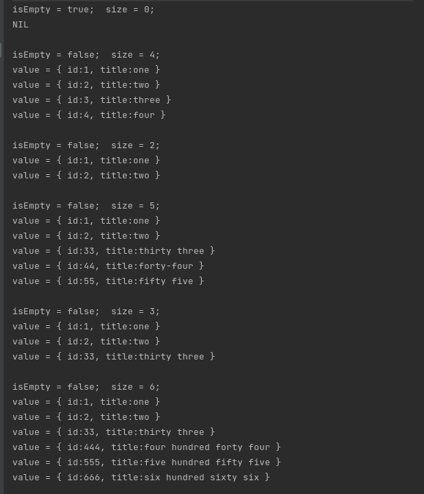

### Mutable linked list with methods add, remote and print.

```scala
package com.itea.task3
```


Declare item list
```scala
val items: Item = Item()
```

Add new item to list
```scala
items add Some(1, "one")
items add Some(2, "two")
items add Some(3, "three")
items add Some(4, "four")
```

Remove item from list
```scala
items.remove
items.remove
```

Print all list of item(s)
```scala
items.print
// NIL  { id:1, title:one }  { id:2, title:two }  { id:33, title:thirty three }  { id:444, title:four hundred forty four }  { id:555, title:five hundred fifty five }  { id:666, title:six hundred sixty six }
```

Use Iterator to iterate the list
```scala
var iterator: Iterator = Iterator()
while ( iterator.hasNext ) {
  val next: Item = iterator.next
  println( "value = " + next.value )
}
```




---

### Simple project with desired structure for small web service, including one congig, one repository, one controller and service.

```scala
package com.itea.task2
```


---

[Zoom * Ссылка на запись 3 занятия](https://us02web.zoom.us/rec/play/BVXbBOF66hy3Xq-xi171bmAgoFsICqY9kxgZUlZySZqLjwZB2IfI77pHjKR_i9ZJVqgZFfSFaT7J6Qu3.r55iJ_NmMQDWEPdk?continueMode=true&_x_zm_rtaid=DNO7J3GWQR6EHNMzIJSxIQ.1633248736226.db941ca5fe7f0beb344ebfdca1724bc4&_x_zm_rhtaid=812)