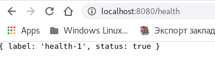

# Scala AutoMapper

* https://github.com/bfil/scala-automapper
  * `Is there something like AutoMapper for Scala?` https://stackoverflow.com/questions/6885558/is-there-something-like-automapper-for-scala
* **(** https://coderoad.ru/6885558/Есть-ли-что-то-вроде-AutoMapper-для-Scala **|**  https://archive.codeplex.com/?p=automapper **)**
  * **(** https://github.com/AutoMapper/AutoMapper **)**

---

( scala case class mapper )
* https://stackoverflow.com/questions/1226555/case-class-to-map-in-scala
* `Scala AutoMapper` https://github.com/bfil/scala-automapper
* `Преобразование класса Scala case в JSON` https://coderoad.ru/44590613/Преобразование-класса-Scala-case-в-JSON
* **(** `Using the Object Mapper with Scala` https://www.datastax.com/blog/using-object-mapper-scala **)**
* **(** `Custom Mappings` https://tpolecat.github.io/doobie/docs/12-Custom-Mappings.html **)**

---

* `in-scala-asinstanceof` https://alvinalexander.com/scala/how-to-cast-objects-class-instance-in-scala-asinstanceof/
* https://www.baeldung.com/scala/type-casting
* `IMPLICIT CLASSES` https://docs.scala-lang.org/overviews/core/implicit-classes.html
* https://docs.scala-lang.org/tour/implicit-conversions.html
* `Преобразование Post в PostDto с помощью ModelMapper` https://sysout.ru/preobrazovanie-entity-v-dto-s-pomoshhyu-modelmapper/
* https://stackoverflow.com/questions/40019089/scala-convert-model-object-to-dto
* `Преобразование между DTO и классами сущностей в Scala` http://blog.khajavi.ir/post/conversion-between-dto-and-entity-classes-in-scala/
* `Chimney` https://github.com/scalalandio/chimney